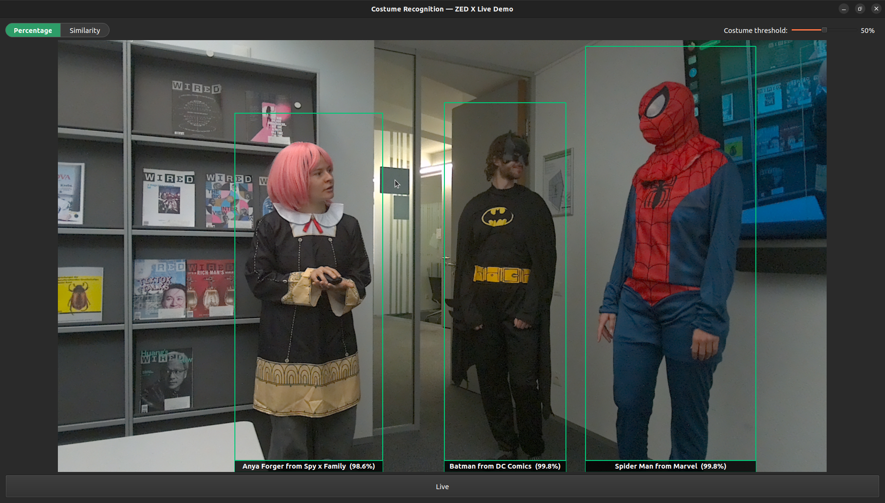

# fcore — Fantasy Basel Costume Recognition System

## Overview

**fcore** is a prototype costume recognition system developed for **DiMi**, a humanoid robot. The system runs on a **ZED Box Orin** paired with a **ZED X camera**. Given a person detected by the camera, the system classifies which of 30 cosplay characters they are dressed as, in real time.



### Comparison of two approaches

The core research question is how a traditional discriminative classifier compares to  a finetuned vision-language embedding model for this task. Two approaches were built and evaluated: 

| | Approach 1 | Approach 2 |
|---|---|---|
| **Model** | ResNet-18, trained from scratch/finetuned | SigLIP2 (`ViT-B-16-SigLIP2-256`), finetuned |
| **Type** | Unimodal vision model, discriminative classifier | Vision-language model, similarity-based classification |
| **Framework** | PyTorch / timm | OpenCLIP |

Both models were benchmarked on the target edge hardware (ZED Box Orin) for inference latency, throughput, and GPU memory footprint, to determine which approach is better suited for real-time deployment on this platform.

## Repository structure

| Folder | Description |
|---|---|
| [`benchmarks/`](./benchmarks) | Benchmarking scripts and results comparing inference time, throughput, and resource usage across models on target hardware |
| [`classification_model/`](./classification_model) | Development of the ResNet-18 classification model (training, hyperparameter sweeps) |
| [`dataset/`](./dataset) | Scripts for crawling and scraping character/costume images to build the training dataset |
| [`openCLIP/`](./openCLIP) | Development and finetuning of the embedding model using OpenCLIP |
| [`midterm_demo/`](./midterm_demo) | Demonstration setup used for the midterm milestone |
| [`final_demo/`](./final_demo) | Final demonstration |
| [`results/`](./results) | Evaluation results and outputs from benchmarking and model comparisons |
| [`server/`](./server) | Server configuration files |

Each folder contains its own README with setup and usage details specific to that component.

## Setup

```bash
pip install -r requirements.txt
```

See the individual component READMEs for model-specific setup (e.g. dataset scraping, model training, demo deployment).

## Hardware

- **Platform:** ZED Box Orin + ZED X camera (standalone, not running on the robot)
- **Context:** deployed alongside DiMi, a TIAGo robot, at Fantasy Basel

