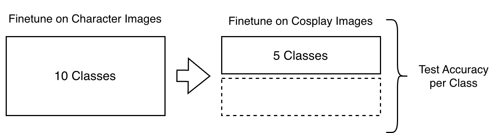

# openCLIP

Development and finetuning of the SigLIP2 embedding model,  including database setup for retrieval, model comparison, finetuning and domain adaptation experiments. 

## Folder structure

```
openCLIP/
├── database/
├── domain_adaptation/
├── finetuning/
├── model_comparison/
├── search_gui/
└── psql_compose.yml
```

## `database/`

Creates the embedding database used for the midterm demo.

1. Run `python3 001_create_database.py`
2. Run `python3 002_create_embeddings.py`

## `domain_adaptation/`

Domain adaptation experiments testing how well the model transfers between the **character** domain (official artwork/promo images) and the **cosplay** domain (real-world photos of people in costume).

*Character images are used as the source (train) domain, adapted toward cosplay images as the target domain (val/test).*

To test it, four training conditions are compared:

| Training condition | First domain | Second domain |
|---|---|---|
| Cosplay | Cosplay | — |
| Character | Character | — |
| Character → Cosplay | Character | Cosplay |
| Cosplay → Character | Cosplay | Character |

**Evaluation:**

1. Run the bash script for evaluating — one run per condition (4 conditions total)
2. `00_evaluate.py` — runs the evaluation
3. **Recommended:** use `eval_all_epochs.bash` — adjust the checkpoint and validation data path, then run the script

`40c_extended_fine_tuning/` tests extensibility of the finetuning approach.

### mixed_tests: 
Tests generalization of learning across domains.
 


## `finetuning/`
 
Finetuning of the SigLIP2 model.
 
- `00_evaluate_baseline` — evaluates baseline (zero-shot) accuracy
- `01_experiment_finetuning` — finetuning experiment using softmax loss
- `02_experiment_finetuning` — finetuning experiment using sigmoid loss
- `eval_all_epochs` — evaluates all epochs on the validation set (adjust the checkpoint and validation data paths before running)

## `model_comparison/`

Benchmarking and comparison between two embedding model architectures:

- `xlm-roberta-base-ViT-B-32` (CLIP)
- `ViT-B-16-SigLIP2` (SigLIP2)

## `search_gui/`

User interface for searching the embedding database, used in the midterm presentation.

